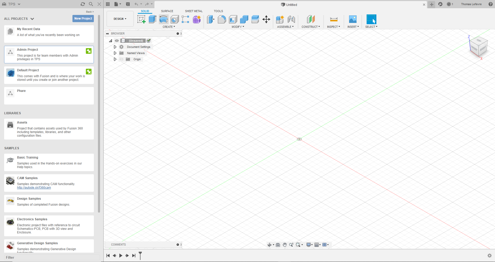
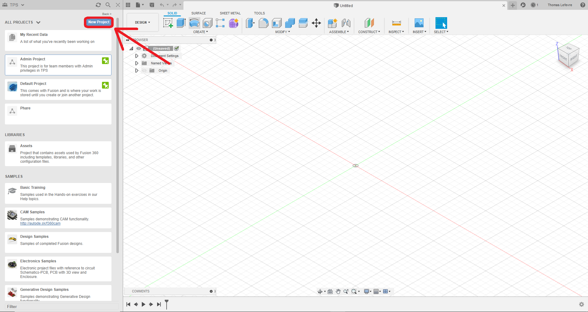

# Formation Fusion 360

## Informations à rajouter

- [X] Retrouver les liens pour apprendre Fusion 360 (vidéos youtube)
- [X] Faire le tutoriel d'installation de Fusion 360
- [ ] Écrire les commandes essentielles pour se mouvoir dans Fusion 360
- [ ] Réaliser le tutoriel pour la modélisation de la première pièce
- [ ] Réaliser le tutoriel pour la modélisation de la deuxième pièce
- [ ] Réaliser le tutoriel pour l'impression 3D

## Déroulement

- Lire les instructions
- Installer Fusion 360 en vous inscrivant à la licence éducative
- Lire les commandes essentielles pour utiliser Fusion 360
- Commencer à modéliser votre première pièce en suivant ce tutoriel et les vidéos
- Commencer à modéliser la deuxième pièce qui sera imprimée en 3D
- Suivre les instructions pour imprimer votre première pièce en 3D

## Installation de Fusion 360

**Cliquez sur le lien qui suit puis suivez les différentes étapes pour vous inscrire à la licence éducative de Fusion 360**

https://www.autodesk.com/education/edu-software/overview?sorting=featured&page=1&filters=individual&search=FUSION

### Etape 1

Descendez en bas de la page et cliquez sur le lien `Get started` pour Fusion 360

### Etape 2

Cliquez sur le bouton `CREATE ACCOUNT`

### Etape 3

Rentrez les informations comme ci-dessous

### Etape 4

Lors de la création de votre compte, rentrez vos VRAIES informations sur votre identité et **rentrez votre adresse Unistra**

### Etape 5

Completez comme ci-dessous en mettant votre année d'arrivée à TPS et l'année à laquelle vous quitterez TPS (si tout va bien)

### Etape 6

Cliquez à nouveau sur le lien de la première étape

### Etape 7

Déposez votre justificatif pour obtenir la licence éducative de Fusion 360, il ne vous reste plus qu'à le télécharger

## Premiers pas dans Fusion 360

Lorsque vous ouvrez Fusion 360 et que vous vous connectez avec le compte que vous venez de créer, vous arrivez sur un écran qui ressemble à ça :

Appuyez sur le bouton en haut à gauche intitulé `New Project`

Appelez ce projet `Formation1`, créez le et double cliquez dessus pour rentrer dedans

Votre page de gauche doit ressembler à ça (sans le TPS tout en haut)

Bien, maintenant que vous avez créé un projet, vous allez créer votre premier objet grâce à plusieurs vidéos et à ce tutoriel, mais avant ça, apprenons à nous déplacer dans Fusion 360

## Quelques commandes de base

Sur la grille à droite de l'écran se trouve l'espace de travail dans lequel on construit des objets. On peut se déplacer de plusieurs façons dans cet espace :

- En maintenant `la molette de la souris` avec le curseur dans la zone de travail et en déplaçant la souris, on effectue une translation dans la zone de travail

- En maintenant `shift` et en maintenant `la molette de la souris` avec le curseur dans la zone de travail et en déplaçant la souris, on effectue une rotation autour de l'emplacement du curseur au début de la manipulation

- En utilisant `la molette de la souris`, on peut zoomer et dézoomer (le zoom se fait en faisant rouler la molette vers l'arrière et le dézoom vers l'avant)

Ces trois commandes sont les trois façons de se déplacer sur Fusion 360. Passons maintenant à la création de notre premier objet

## Création du premier objet

Ce tutoriel s'inspire (très fortement) du tutoriel de *Lars Christensen*, dont la première vidéo est à ce lien :

https://www.youtube.com/watch?v=A5bc9c3S12g

### Etape 1

Faites un clique droit sur `Non enregistré` en haut à gauche de votre espace de travail, puis sur `nouveau composant`
