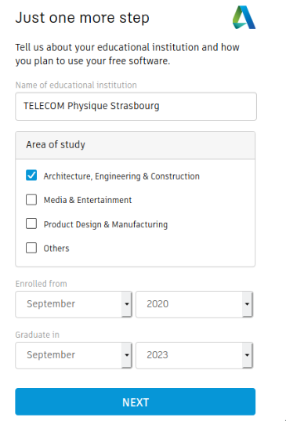

# Formation Fusion 360

## Informations à rajouter

- [ ] Liens pour apprendre Fusion 360 (vidéos youtube)
- [ ]
- [ ]
- [ ]
- [ ]
- [ ]
- [ ]
- [ ]
- [ ]
- [ ]
- [ ]
- [ ]
- [ ]
- [ ]

## Déroulement

- Lire les instructions
- Regarder les vidéos youtube
- Regarder chaque étape pour modéliser l'objet sur Fusion 360

## Installation de Fusion 360

**Cliquez sur le lien qui suit puis suivez les différentes étapes pour vous inscrire à la licence éducative de Fusion 360**

https://www.autodesk.com/education/edu-software/overview?sorting=featured&page=1&filters=individual&search=FUSION

### Etape 1

Descendez en bas de la page et cliquez sur le lien `Get started` pour Fusion 360

### Etape 2

Cliquez sur le bouton `CREATE ACCOUNT`

### Etape 3

Rentrez les informations comme ci-dessous

### Etape 4

Lors de la création de votre compte, rentrez vos VRAIES informations sur votre identité et **rentrez votre adresse Unistra**

### Etape 5

Completez comme ci-dessous en mettant votre année d'arrivée à TPS et l'année à laquelle vous quitterez TPS (si tout va bien)

### Etape 6

Cliquez à nouveau sur le lien de la première étape

### Etape 7

Déposez votre justificatif pour obtenir la licence éducative de Fusion 360, il ne vous reste plus qu'à le télécharger

https://www.youtube.com/watch?v=A5bc9c3S12g
